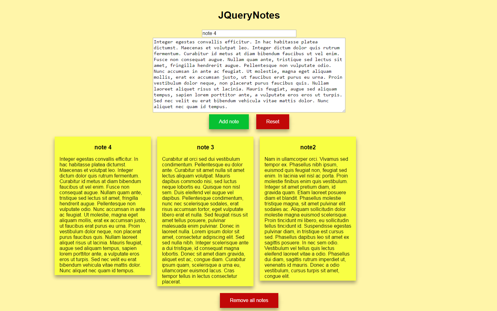

# JQueryNotes

Notes with the possibility to save.

Using JavaScript + jQuery

Notes can be saved in localstorage
When you double-click on a note, you can delete it.

[Demo](https://0vector0.github.io/JQueryNotes/)

***

## Screenshots

